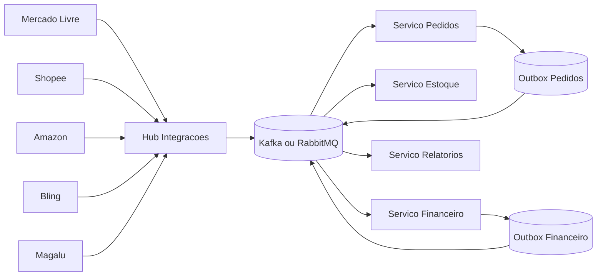

# Arquitetura de Microsservicos com HUB de Integracoes para Financeiro

## Objetivo

Desacoplar o financeiro das APIs de marketplace e gateways, mantendo rastreabilidade completa, alta disponibilidade e tolerancia a falhas.

## Principios

- Modulos separados por dominio de negocio
- Comunicacao assincrona orientada a eventos
- Outbox/Inbox para consistencia entre banco e fila
- Idempotencia por chave de evento
- Auditoria e observabilidade fim a fim
- Multiempresa nativo

## Servicos propostos

- servico-auth: autenticacao, RBAC e tokens
- servico-pedidos: ciclo do pedido omnichannel
- servico-estoque: estoque, custo medio e reposicao
- servico-financeiro: lancamentos, conciliacao, contas, DRE e fluxo
- servico-hub-integracoes: conectores externos (Bling, ML, Shopee, Amazon, Magalu)
- servico-notificacoes: alertas, e-mail, webhook de retorno
- servico-relatorios: materializacao de indicadores e BI

## Fluxo de integracao recomendado

Marketplace/API externa -> Connector no HUB -> Evento canonical -> Financeiro/Pedidos/Estoque

Assim, uma mudanca de API externa impacta apenas o conector, sem quebrar o dominio financeiro.

## Topologia de eventos



## Eventos canonicos

### Pedidos e vendas

- sales.order.created
- sales.order.paid
- sales.order.canceled
- sales.order.refunded

### Financeiro

- financeiro.lancamento.criado
- financeiro.lancamento.baixa_parcial
- financeiro.lancamento.pago
- financeiro.conciliacao.divergencia_detectada
- financeiro.conciliacao.realizada
- financeiro.conta_pagar.aprovada
- financeiro.fluxo_caixa.projecao_gerada

### Integracoes

- integracao.sync.iniciada
- integracao.sync.concluida
- integracao.sync.falhou
- integracao.webhook.recebido

## Contrato de evento padrao

```json
{
  "id": "uuid",
  "nome": "financeiro.lancamento.criado",
  "empresaId": "uuid",
  "timestamp": "2026-05-12T18:30:00Z",
  "correlationId": "uuid",
  "source": "servico-financeiro",
  "schemaVersion": "1.0.0",
  "payload": {
    "lancamentoId": "uuid",
    "tipo": "RECEITA",
    "origem": "MERCADO_LIVRE",
    "valorLiquido": 1948.24,
    "status": "PENDENTE"
  },
  "metadata": {
    "requestId": "uuid",
    "tenant": "empresa_1"
  }
}
```

## Regras operacionais essenciais

- Cada consumidor salva event_id processado (tabela inbox) para evitar duplicidade
- Falha de processamento move mensagem para DLQ
- Reprocessamento com retentativa exponencial
- Telemetria com traces distribuidos e correlationId
- Logs estruturados por evento e empresa

## Estrategia de banco por servico

- Cada servico com banco isolado (database per service)
- Integracao entre servicos via eventos, nao via join cross-service
- Dados para BI em camada de leitura (read model) no servico-relatorios

## Observabilidade

- metricas: latencia de consumidores, backlog de fila, taxa de erro por conector
- logs: sucesso/falha por evento com payload minimizado
- tracing: OpenTelemetry do ingresso no HUB ate projecoes financeiras
- alertas: divergencia de conciliacao, atraso de sync, falha em webhook

## Segurança e compliance

- Assinatura de webhooks externos
- Criptografia em transito (TLS) e em repouso
- Segregacao por empresa no payload e no banco
- Trilha de auditoria de todas as alteracoes financeiras

## Roadmap de implantacao

1. Fase 1: HUB + eventos de pedidos pagos/cancelados + lancamentos basicos
2. Fase 2: conciliacao automatica cartoes/gateways + contas a pagar
3. Fase 3: DRE e fluxo de caixa projetado com read models
4. Fase 4: IA financeira para previsao e recomendacoes
